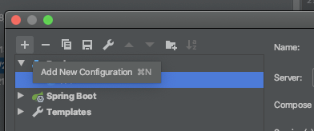
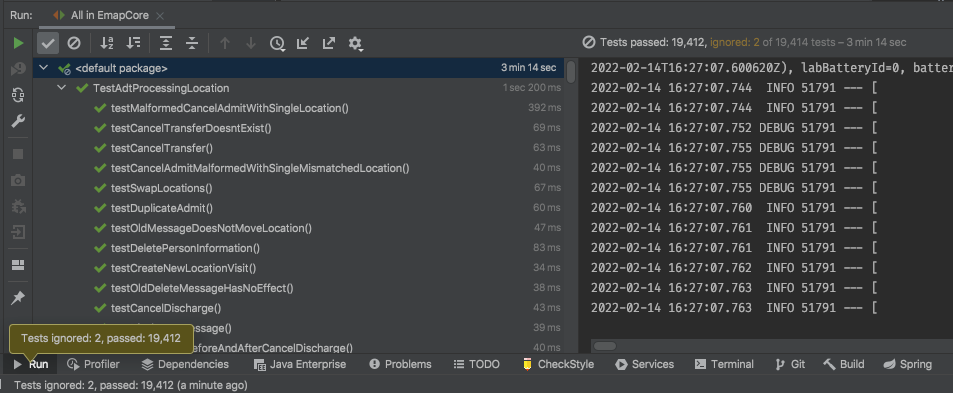

# Emap Core

This services takes messages from a queue and compares this data to the current data in the EMAP database.
Generally if a message has newer information that is different, then the message will update the database data,
otherwise the message will have no effect. This is important because the HL7 messages can be received out of order.

# Local setup instructions using IntelliJ IDEA

These setup instructions are aimed at developing in IntelliJ IDEA, but hopefully should be similar in Eclipse

1. before creating a project in your IDE, create a parent directory for the project e.g. `~/projects/EMAP`
1. clone the Emap-Core, Inform-DB and Emap-Interchange repositories into this parent directory
1. In IntelliJ, go to File > New > New Project From existing sources and select the parent directory. If prompted, choose "Create project from existing sources"
1. In the project pane on the top left of the IDE, switch to "Project Files" mode, right click the `Emap-Core/pom.xml` and select "Add as Maven project".
   Do the same with `Emap-Interchange/pom.xml` and `Inform-DB/pom.xml` - not to be confused with `Inform-DB/inform-db/pom.xml`! If you add something by mistake, "Unlink Maven projects" in the Maven pane is the opposite of "Add..."
1. Allow annotation processing by going to File > Settings > and searching for `processor`
    - check `enable annotation preprocessing`
    - change the production sources directory to `classes`
      
1. In the `Maven` pane (which should now have appeared on the top right of the IDE), click the `Reimport all maven projects` (says `Reload` on Jeremy's version)
1. Ensure that you have lombok and checkstyle plugins installed in your IDE. (File > Settings > search for plugins)
1. Setup checkstyle (File > settings > search for checkstyle)
    - set the version of checkstyle to the latest version
    - click on the `+` to add a new checkstyle configuration
      
1. Make a description and select the checkstyle file in `Emap-Core/inform-checker.xml`. When done, tick box to make the new configuration active.
   
   you can now run checkstyle from the bottom panel in the IDE

## Running tests using local services

- Now you can create a run configuration for running all tests
    - Run > Edit Configurations
    - click on the `+` at the top left-hand side of the window
      
    - Select `Junit` from the drop down
        - Set Test kind to `All in package`
        - Set the package to `uk.ac.ucl.rits.inform.datasinks.emapstar`
        - You may also want to set logging level to TRACE for our classes by defining the environmental variable:
          `LOGGING_LEVEL_UK_AC_UCL=TRACE`
- You can run the tests from the run configurations drop-down (this can take a while).
  
    - if this fails to compile, you may need to go to the maven pane on the right-hand side and
      run the Lifecycle `clean` goal for: `Inform Annotations` and `Inform-DB`.
      Then `clean` and then `install` on `Emap Star Schema`
    - After this then select the `Reload All Maven Projects` icon at the top of the same pane as shown below

      
    
    - You may also need to run `Generate Sources and Update Folders For All Projects` 

# How to deploy a live version

How to deploy an instance of Emap on the ULCH GAE, to be run on real patient data. 

## source code location and setup

Find a place to put the source code. If this instance is not attached to a person, a directory in `/gae` is a good place. For example, Jeremy has deployed a live version of Emap in `/gae/emap-live/`, and this will be the example used in these instructions.

Once the directory has been created, it must be set up correctly:
 * `mkdir /gae/emap-live`
 * `chgrp -R docker /gae/emap-live` -- set group to docker
 * `chmod -R g+rws /gae/emap-live` -- allow docker group the right access. `s` ensures the group ownership is inherited (but not the permissions)
 * `setfacl -R -m d:g::rwX  /gae/emap-live` -- ensure the permissions for the group are also inherited

It should now look like:

```
$ ls -la /gae/emap-live
total 8
drwxrws---+  2 jstein01 docker 4096 Oct 16 10:59 .
drwxrwx---. 22 root     docker 4096 Oct 16 10:52 ..

```

You can `touch` a file and `mkdir` a dir to test that group and group permissions get inherited.

### git config

Ideally: Authentication should not be tied to any one user, we have the github user `inform-machine-user` for this. 
The password can be distributed through Lastpass to those who need it. 
The email address for the github account is a gmail account that also has its details in Lastpass.

For now: use your own username+password to clone/fetch/etc from github. Jeremy puts the following in his `~/.gitconfig` on the GAE to reduce typing:

```
[credential "https://github.com"]
    username = jeremyestein
```
You will also need to create a github token as password access from git CLI is now deprecated.
You will probably want to configure the credential helper to store the token access token 
(this will store the connection information in plain text in your home directory)

```shell
git config --global credential.helper store
```

We use https because outgoing ssh is blocked from the GAE.

Repositories must be checked out to the correct branches. "Correct" will depend on what you're trying to do. Conventionally a live instance would all be deployed off master, but during the development phase `develop` is more likely to be the correct branch. Occasionally you may need to deploy off a feature branch - if in doubt ask the author of that code.

 * `git clone --branch develop https://github.com/inform-health-informatics/Emap-Core.git`
 * `git clone --branch master https://github.com/inform-health-informatics/Emap-Interchange.git`
 * `git clone --branch develop https://github.com/inform-health-informatics/Inform-DB.git`

## config

Supply the required config files in the `Emap-Core` directory (see below in readme for details). Make sure `UDS_SCHEMA` is set to what it needs to be, in this example I'm using `live`. If you're writing to the UDS, use the `uds_write` user (password in lastpass).

## docker config

You need the `-p` option to `docker-compose` to make sure the container and network names don't clash.

`docker-compose -p emaplive up --build -d`

### Adding in a fake UDS

In dev environments, you may want to make your own UDS in a docker container.
It could also double as an IDS as there's nothing to say these can't be on the same postgres instance.

This container is defined in a separate docker-compose file, so you need to specify both files as below:

`docker-compose -f docker-compose.yml -f docker-compose.fakeuds.yml -p emaplive up --build -d`

## Password protecting Glowroot

Glowroot central requires cassandra to be running in order to set up a password.
It must also be done prior to the first run. Hence it cannot be done in the
Dockerfile. Instead, prior to bringing up emap you should use the `emap.sh`
script to intialise glowroot-central with the following:

```
Emap-Core/emap.sh run glowroot-central java -jar "glowroot-central.jar" setup-admin-user "${GLOWROOT_USERNAME}" "${GLOWROOT_PASSWORD}"
```

## `emap.sh` script and Emap-in-a-box

To make running with multiple docker-compose files easier, there's a script called `emap.sh` which can run the above command for you. 
It's a wrapper around `docker-compose` that works out what the "stem" of the command should be (the `-f` and `-p` options, 
and you just have to pass in the compose commands like `ps`, `up`, `down`, etc).

By default it gives you the full Emap-in-a-box experience, 
ie. you get a dockerised postgres server to act as a UDS, and you get a rabbitmq server. 
To avoid this you would need to pass the service names you need to the script (see docker-compose help).

Useful command: `./emap.sh ps --services` to list available services.

It needs configuring with at least one environment variable `EMAP_PROJECT_NAME`
which must be defined in `global-config-envs` in the directory `config`, adjacent to `Emap-Core` and friends.

Because this is just a file containing environment variables, 
you can actually put all the local ports here as well, 
instead of spreading them over multiple `.env` files inside the repository dirs themselves:

Example `global-config-envs`:
```bash
EMAP_PROJECT_NAME=jes1
RABBITMQ_PORT=5972
RABBITMQ_ADMIN_PORT=15972
FAKEUDS_PORT=5433
```

> **_NOTE:_** All of: `Emap-Core`, `Emap-Interchange`, `Inform-DB`, `DatabaseFiller`, `emap-hl7-processor` and `hoover` need to be cloned. 

### Example

I've appended the docker-compose command `ps` to `emap.sh`, a
and you can see all the services from all our repos in one place!
```
(develop) $ ./emap.sh ps
Global Emap config file: /Users/jeremystein/Emap/global-config-envs
++ docker-compose -f /Users/jeremystein/Emap/Emap-Core/docker-compose.yml -f /Users/jeremystein/Emap/Emap-Core/docker-compose.fakeuds.yml -f /Users/jeremystein/Emap/Emap-Core/../DatabaseFiller/docker-compose.yml -p jes1 ps
WARNING: The HTTP_PROXY variable is not set. Defaulting to a blank string.
WARNING: The http_proxy variable is not set. Defaulting to a blank string.
WARNING: The HTTPS_PROXY variable is not set. Defaulting to a blank string.
WARNING: The https_proxy variable is not set. Defaulting to a blank string.
      Name                    Command                State                                               Ports                                           
      ---------------------------------------------------------------------------------------------------------------------------------------------------------
      jes1_dbfiller_1    java -jar ./target/DBFille ...   Exit 255                                                                                             
      jes1_emapstar_1    /usr/local/bin/mvn-entrypo ...   Up                                                                                                   
      jes1_fakeuds_1     docker-entrypoint.sh postgres    Up         0.0.0.0:5433->5432/tcp                                                                    
      jes1_hl7source_1   /usr/local/bin/mvn-entrypo ...   Up                                                                                                   
      jes1_rabbitmq_1    docker-entrypoint.sh rabbi ...   Up         15671/tcp, 0.0.0.0:15972->15672/tcp, 25672/tcp, 4369/tcp, 5671/tcp, 0.0.0.0:5972->5672/tcp
```

## Dependencies and configuration

The Dockerfiles have to build the dependencies before building Emap-Core. 
Therefore your local directory structure has to be like this:

```
Emap [project dir, name doesn't actually matter]
 |
 +-- config
 |  |
 |  +-- global-config-envs [global emap config file]
 |  +-- FOO1-config-envs [config file for service FOO1]
 |  +-- FOO2-config-envs [config file for service FOO2]...
 +-- Emap-Core [git repo]
 |  |
 |  +-- emap.sh [runs emap, optionally in a box]
 |  +-- docker-compose.yml [sets build directory to be .. (aka Emap)]
 +-- Emap-Interchange [git repo]
 +-- Inform-DB [git repo]
 +-- Some-Other-Repo [your repo goes here, eg. Caboodle]
```

The `docker-compose.yml` file sets the build directory to be the project root directory, to allow the Emap-Core Dockerfiles
to reference the code containing the dependencies.

## `FOO-config-envs` file

Each service has its own configuration file, which is used by the service's `application.properties` file.

The required envs in this file with example values are found in [emap-core-config-envs.EXAMPLE](emap-core-config-envs.EXAMPLE)

## `rabbit-envs` file

This sets the username+password on the rabbitmq server. If you're on the GAE this should be a strong password to help prevent a user/malware outside the GAE from accessing the queue.

[rabbitmq-config-envs.EXAMPLE](rabbitmq-config-envs.EXAMPLE)

## `global-config-envs` file

This is used for specifying which port on the host your rabbitmq queue, fakeuds port should bind to, and for specifying the project name (`-p` option to docker-compose) to keep the Emap instances on the same docker host separate. Example found here:

[global-config-envs.EXAMPLE](global-config-envs.EXAMPLE)

If you're running on your own machine, you can set EMAP_PROJECT_NAME to whatever you like. If running on the gae I suggest something like `yourname_dev` or `emaplive` depending on which instance you are manipulating.

Ports which are allocated per project are listed on the [GAE port log](https://liveuclac.sharepoint.com/sites/RITS-EMAP/_layouts/OneNote.aspx?id=%2Fsites%2FRITS-EMAP%2FSiteAssets%2FInform%20-%20Emap%20Notebook&wd=target%28_Collaboration%20Space%2FOrganisation%20Notes.one%7C3BDBA82E-CB01-45FF-B073-479542EA6D7E%2FGAE%20Port%20Log%7C1C87DFDC-7FCF-4B63-BC51-2BA497BA8DBF%2F%29
onenote:https://liveuclac.sharepoint.com/sites/RITS-EMAP/SiteAssets/Inform%20-%20Emap%20Notebook/_Collaboration%20Space/Organisation%20Notes.one#GAE%20Port%20Log&section-id={3BDBA82E-CB01-45FF-B073-479542EA6D7E}&page-id={1C87DFDC-7FCF-4B63-BC51-2BA497BA8DBF}&end). 
Please use a strong password on your rabbitmq server.
