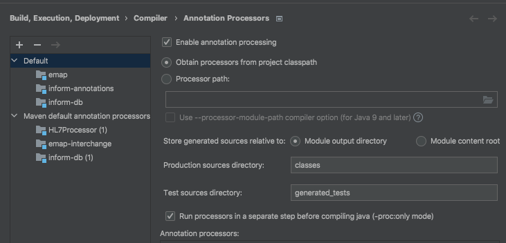
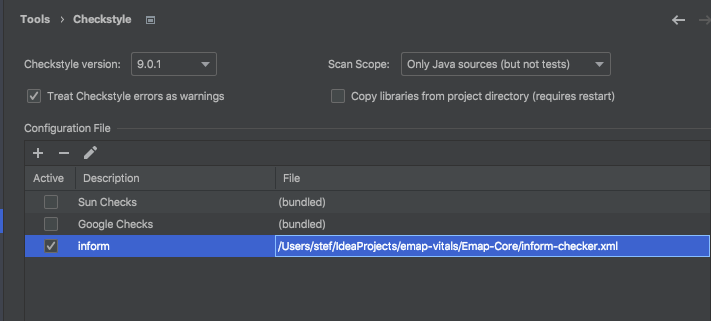

# Emap Core

This service takes messages from a queue and compares this data to the current data in the EMAP database.
Generally, if a message has newer information that is different, then the message will update the database data,
otherwise the message will have no effect. This is important because the HL7 messages can be received out of order.

## Local setup instructions using IntelliJ IDEA

These setup instructions are aimed at developing in [IntelliJ IDEA](https://www.jetbrains.com/idea/), but hopefully should be similar in [Eclipse](https://www.eclipse.org/downloads/).

1. <details>
    <summary>Create a parent directory</summary>
   
    Create a directory where all the repositories, including this one, will be cloned
    e.g.
   
    ```bash
    mkdir ~/projects/EMAP
    ```
</details>

2. <details>
    <summary>Clone repositories</summary>
   
    Emap-Core depends on both [Inform-DB](https://github.com/inform-health-informatics/Inform-DB) and [Emap-Interchange](https://github.com/inform-health-informatics/Emap-Interchange).
    Clone each of them with e.g.

    ```bash
    cd ~/projects/EMAP
    git clone https://github.com/inform-health-informatics/Emap-Core.git
    git clone https://github.com/inform-health-informatics/Emap-Interchange.git
    git clone https://github.com/inform-health-informatics/Inform-DB.git
    git clone https://github.com/inform-health-informatics/emap-hl7-processor.git
    git clone https://github.com/inform-health-informatics/hoover.git
    ```
   
   This could also be achieved with [emap-setup](https://github.com/inform-health-informatics/emap-setup) by, once installed, running `emap setup --init`

</details>

3. <details>
    <summary>Open project in IntelliJ IDEA</summary>
   
    <b>File > New > New Project From existing sources</b> and select the parent directory (e.g. `~/projects/EMAP`). If prompted, choose "Create project from existing sources" and "Unmark All" if prompted to select source files for the project.
</details>

4. <details>
    <summary>Add Maven projects</summary>
   
    In the project pane on the top left of the IDE, switch to "Project Files" mode, right-click `Emap-Core/pom.xml` and select <b>Add as Maven project</b>.
    Do the same with `Emap-Interchange/pom.xml` and `Inform-DB/pom.xml` - not to be confused with `Inform-DB/inform-db/pom.xml` (which contains the Hibernate entity definitions, but requires the annotation preprocessor)! Likewise with `hoover/pom.xml` and `emap-hl7-processor/pom.xml` 
    If you add something by mistake use "Unlink Maven projects" in the Maven pane, which is the opposite of "Add..."
</details>

5. <details>
    <summary>Allow annotation processing</summary>
   
    Go to <b>File > Settings > and searching for `processor`</b>
    - Check `enable annotation preprocessing`
    - Change the production sources directory to `classes` as below
   
    
</details>

6. <details>
    <summary>Reload Maven projects</summary>
   
    In the `Maven` pane (which should now have appeared on the top right of the IDE),
    click **Reimport all maven projects** or **Reload**
</details>

7. <details>
    <summary>Add lombok and checkstyle plugins</summary>
   
    Go to <b>File > Settings > search for plugins</b>, search lombok and checkstyle and install them
</details>

8. <details>
    <summary>Setup checkstyle</summary>
   
    To allow checkstyle to be run go to <b>File > settings > search for checkstyle</b>
    - Set the version of checkstyle to the latest version
    - Click on the `+` to add a new checkstyle configuration

    

    - Make a description and select the checkstyle file in `Emap-Core/inform-checker.xml`. When done, in the bottom panel of the IntelliJ select the inform rules to make the new configuration active.
    
</details>


## Running tests

Emap-Core and the other repositories include unit tests in `<repo-name>/src/test/java`.  Run all the tests by

1. <details>
    <summary>Creating a configuration</summary>
   
    - <b>Run > Edit Configurations</b>
    - Click on the `+` at the top left-hand side of the window
      
    - Select `Junit` from the drop down
        - Set Test kind to `All in package`
        - Set the package to `uk.ac.ucl.rits.inform.datasinks.emapstar`. Or set the module to e.g. Emap-Core and the package to `uk.ac.ucl.rits.inform`
        - You may also want to set logging level to TRACE for our classes by defining the environmental variable:
          `LOGGING_LEVEL_UK_AC_UCL=TRACE`

</details>

2. <details>
    <summary>Compiling and running</summary>
    
    Go to <b>Run > Run</b>, which should create a window in the bottom pane
    

    - If this fails to compile, you may need to go to the maven pane on the right-hand side and
      run the Lifecycle `clean` goal for: `Inform Annotations` and `Inform-DB`.
      Then `clean` and then `install` on `Emap Star Schema`
    - After this then select the `Reload All Maven Projects` icon at the top of the same pane as shown below

      

    - You may also need to run `Generate Sources and Update Folders For All Projects`
</details>

Tests can also be run individually by clicking the play button on a class within an IDE editor window.

## Deploying a live version

How to deploy an instance of Emap on the ULCH GAE, to be run on real patient data. [emap-setup](https://github.com/inform-health-informatics/emap-setup)
manages the multiple repositories and configuration files.


1. <details>
    <summary>Create a directory with the correct permissions</summary>

    > **Note**
    > These folders probably already exist in `/gae`. Create a new one only if a new schema is availible


    Find a place to put the source code. If this instance is not attached to a person, a directory in `/gae` is a good place. For example, `/gae/emap-live/`, and this will be the example used in these instructions.
    e.g.
    
    ```bash
    mkdir /gae/emap-live
    chgrp -R docker /gae/emap-live
    chmod -R g+rwx /gae/emap-live
    setfacl -R -m d:g::rwX /gae/emap-live
    ```
    
    to create, modify the group, change ownership and inherit permissions.
    
    It should now look like e.g.
    
    ```bash
    $ ls -la /gae/emap-live
    total 8
    drwxrws---+  2 jstein01 docker 4096 Oct 16 10:59 .
    drwxrwx---. 22 root     docker 4096 Oct 16 10:52 ..
    ```
   
</details>

2. <details>
    <summary>Set the git configuration</summary>

    Create a [personal access token](https://docs.github.com/en/github/authenticating-to-github/keeping-your-account-and-data-secure/creating-a-personal-access-token) 
    for the next step and allow your username and access token to be saved with

    ```shell
    git config --global credential.helper store
    ```

    **Note**: this will allow storage of the connection information in plain text in your home directory. We use https 
    as a default but SSH is also possible.
</details>

3. <details>
    <summary>Install <b>emap-setup</b></summary>
   
    See the emap-setup [README](https://github.com/inform-health-informatics/emap-setup/blob/main/README.md) for details

</details>


4. <details>
    <summary>Modify configuration</summary>
   
    Modify `global-configuration.yaml` with any passwords, usernames and URLs that need to be changed for a live version.
    these will propagate into the individual `xxx-config-envs` configuration files, which in turn are used 
    by the`application.properties`.
    
    - For example, make sure `UDS_SCHEMA` is set to what it needs to be, in this example `live` is used. If you're writing to the UDS, use the `emap_core` user (password in lastpass).
    - If you're running locally, you can set `EMAP_PROJECT_NAME` to whatever you like. If running on the GAE it should be the same as the current directory (i.e. `emap-test` if in `/gae/emap-test`)
    - All passwords should be strong to help prevent a user/malware outside the GAE from accessing the queue.
    
</details>

5. <details>
    <summary>Clone the repositories</summary>

    Repositories must be checked out to the correct branches. "Correct" will depend on what you're trying to do.
    Conventionally a live instance would all be deployed from master, but during the development phase `develop`
    or a feature branch is more likely to be the correct. Clone all the master branches with:

    ```bash
    emap setup --init --branch master
    ```

    This will result in the following directory structure

    ```bash
    $ tree -L 1
    .
    ├── Emap-Core
    ├── Emap-Interchange
    ├── Inform-DB
    ├── config
    ├── emap-hl7-processor
    ├── global-configuration.yaml
    └── hoover 
   ```

</details>

6. <details>
    <summary>Creating an instance</summary>
   
    ```bash
    emap docker up -d
    ```

    Check the status with 
    ```bash
    emap docker ps
    ```
   
    For example, this may give
    ```
    $ emap docker ps
    Name                    Command                State                                               Ports                                           
    ---------------------------------------------------------------------------------------------------------------------------------------------------------
    jes1_emapstar_1    /usr/local/bin/mvn-entrypo ...   Up                                                                                                   
    jes1_fakeuds_1     docker-entrypoint.sh postgres    Up         0.0.0.0:5433->5432/tcp                                                                    
    jes1_hl7source_1   /usr/local/bin/mvn-entrypo ...   Up                                                                                                   
    jes1_rabbitmq_1    docker-entrypoint.sh rabbi ...   Up         15671/tcp, 0.0.0.0:15972->15672/tcp, 25672/tcp, 4369/tcp, 5671/tcp, 0.0.0.0:5972->5672/tcp
    ```
   
</details>


## Miscellaneous

Ports which are allocated per project are listed on the [GAE port log](https://liveuclac.sharepoint.com/sites/RITS-EMAP/_layouts/OneNote.aspx?id=%2Fsites%2FRITS-EMAP%2FSiteAssets%2FInform%20-%20Emap%20Notebook&wd=target%28_Collaboration%20Space%2FOrganisation%20Notes.one%7C3BDBA82E-CB01-45FF-B073-479542EA6D7E%2FGAE%20Port%20Log%7C1C87DFDC-7FCF-4B63-BC51-2BA497BA8DBF%2F%29)

