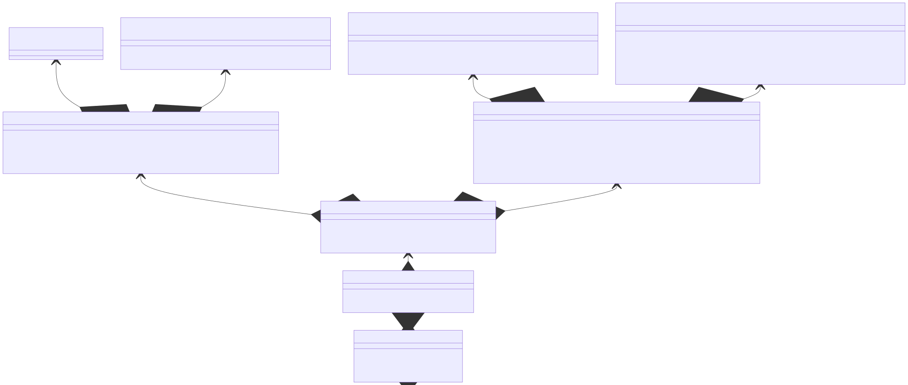
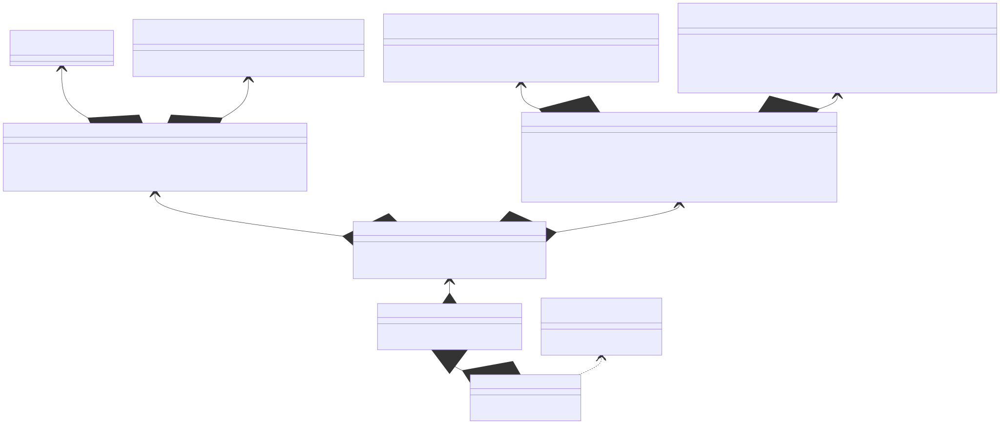

# Experimental Medical Application Platform (EMAP)

## Introduction

A technical overview of EMAP can be found in
the [Technical_overview_of_EMAP.md](/docs/technical_overview/Technical_overview_of_EMAP.md)

There are currently two data sources for EMAP:

- HL7 data
    - Persisted in
      the [Immutable Data Store](/docs/technical_overview/Technical_overview_of_EMAP.md#immutable-data-store-ids)
      (IDS), from a copy of specific HL7 message streams
    - The IDS is read by
      the [HL7 reader](/docs/technical_overview/Technical_overview_of_EMAP.md#hl7-reader),
      (defined in the [hl7-reader](https://github.com/UCLH-DHCT/emap/tree/main/hl7-reader) module)
      converting the HL7 message into a source-agnostic format (interchange message, defined in
      the [emap-interchange](https://github.com/UCLH-DHCT/emap/tree/main/emap-interchange) module)
      and published to a rabbitMQ queue for processing by the core processor.
- Hospital database polling
  -
  The [Hoover](/docs/technical_overview/Technical_overview_of_EMAP.md#hoover)
  (defined in the [hoover](https://github.com/UCLH-DHCT/hoover) repository)
  service polls hospital databases (Clarity and Caboodle) for data that has changed since the last poll.
  It converts the query outputs into the interchange message and publishes these to a rabbitMQ queue for processing by
  the core processor.
  We can't make the Hoover repository public because the SQL queries contain the intellectual property of the hospital
  patient record system, EPIC.

The [core processor](/docs/technical_overview/Technical_overview_of_EMAP.md#the-eventprocessor)
(defined in the [core](https://github.com/UCLH-DHCT/emap/tree/main/core) module) is responsible for processing the
interchange messages and
updating
the [emap database](/docs/technical_overview/Technical_overview_of_EMAP.md#star-schema)
(defined in the [emap-star](https://github.com/UCLH-DHCT/emap/tree/main/emap-star) module).

The core processor compares what is already known in the EMAP database, with the data in the interchange message and
updates the EMAP database accordingly.
We can receive HL7 messages out of order so the processor must be able to handle this.

## Development guide

All the EMAP services use the Spring-Boot framework and are written in Java. Setup instructions are found in
the [emap repo](https://github.com/UCLH-DHCT/emap/blob/main/docs/intellij.md)
with additional information for hoover in the [hoover repo](https://github.com/UCLH-DHCT/hoover).

A decision log for technical choices for a module can be found in
its [dev/design_choices.md](https://github.com/UCLH-DHCT/emap/blob/main/core/dev/design_choices.md) file.

### Hl7-reader

#### Development

Each HL7 message can produce one or more interchange messages, depending on the type of the message there are different
patterns used in the codebase to process the HL7 message.

As an example, the following diagram shows the processing of an `ORM^O01` HL7 message type which can either result in
a single `ConsultRequest` interchange message or a list of `LabOrderMsg` interchange messages
(these have been simplified in the diagram).

Flow of the processing:

- All HL7 messages are processed by the `mainLoop` method of the `AppHl7` class,
  which delegates reading and processing of HL7 messages into interchange messages to the `IdsOperations` class, and
  then publishes to the queue using the `Publisher` class.
- The `IdsOperations` class is responsible for reading the HL7 messages from the IDS and delegates the processing of
  HL7.
  In this case `ORM` messages are an Order Message, so the message is routed to the `OrderAndResultService`.
- The `OrderAndResultService` can determine the source and type of the message, which can delegate to
  the `ConsultFactory` for a consultation request, or `LabFunnel` for a lab order.
    - If this is a consultation request, the `ConsultFactory` will create a `ConsultRequest` interchange message and
      return this up the call stack for publishing.
- The `LabFunnel` will use the `OrderCodingSystem` to route the HL7 message type to the correct `LabOrderBuilder`
  subclass.
    - Each builder extracts common elements from the HL7 message, using its parent class' methods to create one or
      more `LabOrderMsg` interchange message.

#### Testing

- For service testing, fake HL7 messages are manually created for each message type and stored in
  the `src/test/resources` directory.
- To reduce repetition of configuration and annotations, the `TestHl7MessageStream` class is extended in each test
  class.
    - This contains a `processSingleAdtMessage` method which takes the path of the fake HL7 message and processes it
      into
      an interchange message for assertions.
    - This method tests at the `IdsOperations` level, so the `Publisher` does not need to be mocked.
- Unless there is very tricky areas of logic, we don't unit test message processing, instead setting up test cases of
  HL7 -> interchange messages and checking that this is processed as expected
- To have certainty that our end-to-end testing from hl7-reader -> core -> emap-star database works correctly,
  test methods are added to the `TestHl7ParsingMatchesInterchangeFactoryOutput` test class, which takes in HL7 messages
  as an input
  and serialised interchange messages in yaml format as an expected output and asserts that they match.
    - These serialised interchange messages are then used in emap core testing
    - To ensure that all serialised interchange messages from the hl7-reader have an HL7 message that produces them,
      the `InterchangeMessageFactory`
      is created with Monitored Files, an exception will be thrown if there are any interchange messages which have not
      been read while running the test class.

### Hoover

#### Development

The hoover service requires native queries to be written for Clarity and Caboodle, so local development uses docker
containers running sqlserver
with fake data to test the queries. These are defined in `test-files/clarity` and `test-files/caboodle`.
Be sure to follow
the [local setup instructions](https://github.com/UCLH-DHCT/hoover#local-setup-instructions-using-intellij-idea)
before starting work on the service.

Each data type processed by Hoover is represented by its own class that implements the `QueryStrategy` interface, and
has a SQL file in the `src/main/resources/sql` directory.

An example is shown in the following diagram (simplified):

- The `Application` class creates a Spring Component that is an instance of the `Processor` class, initialised with
  a `QueryStrategy` instance, in this case `LocationMetadataQueryStrategy`.
    - This component is taken as an argument to the `runBatchProcessor` method, which delegates the scheduling of the
      database polling to the `BatchProcessor` class.
- The `Processor` class uses the `QueryStrategy` interface to get the previous progress for the data type, and query for
  any
  new data since the most recent progress.
- Defining the SQL query and how this data is processed is implemented by the `LocationMetadataQueryStrategy` class.
    - To allow for sqlfluff linting of SQL queries, the SQL is persisted to the `src/main/resources/sql` directory, and
      linked to by the `getQueryFilename` method.
    - the `getBatchOfInterchangeMessages` method queries the database, returns a list of Data Transfer Objects (DTOs),
      in
      this case `LocationMetadataDTO`.
    - In this case, the `LocationMetadataDTO` can build a `LocationMetadata` interchange message and these are returned
      up
      the call stack for publishing using the `Publisher` class.

#### Testing

- For each data type, as a minimum you should carry out testing from a query within a time window and assert that the
  expected data is returned.
    - The expected data should include the serialised interchange messages in yaml format that will be read by the core
      processor during testing.
    - As the databases are static, creating specific test conditions within a time window is the easiest way to have
      specific tests.
- Each test class should implement the `TestQueryStrategy` interface, which adds in default tests once you have
  implemented the required methods for metadata about the test.
    - This also gives helper methods to be able to test a time window of data and assert that the batch of interchange
      messages matches the yaml files.

### Core

#### Development

Message processing within core follows a general pattern of:

- Read message from queue and delegate to processor class
- Processor class uses one or more controllers to update or create the relevant entities from the hl7 message
- Controllers use repositories carry out business logic for what exists in the database, and what should be updated or
  created.
- Repositories use Spring Data JPA to interact with the database tables directly.

An example is shown in the following diagram (simplified)

- Each interchange message uses double dispatch so that the class of the interchange message can be known at runtime
  without checks.
  The `InformDbOperations` class implements the `EmapOperationMessageProcessor` interface to enable the double
  dispatch.  
  The `processMessage` method delegates to a `Processor` class for each family of messages, in this case
  the `LabProcessor` is used.
- Each processor class has one or more `Controller` classes, which allow for the business logic of comparing the current
  and previous state from the database and making a decision on what the correct outcome is.
  The processor class uses these delegated classes to update or create entities which are used by other controllers.
- Each controller class can use other controllers (for complex data types which span 6+ tables), interact with tables
  using a `Cache` component or directly interact with the database using a `Repository` interface.
    - In this case, the `LabController` uses the `LabCache` component,
      this is because Spring Boot caching annotations are ignored when a method call is made by the same class.
      Breaking this out into a separate component allows for data type metadata to be cached to reduce the number of
      queries to the database and improve performance.
      The `LabCache` component itself can interact with `Repositories` because it is a Spring Component.
    - The `LabController` also uses the `LabOrderController`, which then uses specific `Repositories` to interact with
      the
      SQL tables in emap star.
- Most tables in emap star have an `Audit` equivalent, this allows for the history of each entity to be tracked.
    - We have defined an `@AuditTable` to generate Java classes for these entities that are then represented as tables
      in
      emap star.
      This can be found in
      the [emap-star/emap-star-annotations](https://github.com/UCLH-DHCT/emap/tree/main/emap-star/emap-star-annotations)
      maven module.
    - An Audit table must extend the `TemporalCore` class, generics are used to link the entity class and its audit
      entity
      class.
    - The `RowState` class acts as a wrapper around an entity to help with determining if differences should be
      persisted
      to the database (and if it already exists, audited).

#### Testing

- All testing is carried out from interchange messages persisted in yaml format, as used by the source services.
- Test classes should extend the `MessageProcessingBase`, which provides class fields and configuration for testing.
    - the `messageFactory` field is used to create interchange messages from yaml files
    - there are `processSingleMessage` and `processMessages` methods which take interchange messages and process the
      message(s) into an in memory database for testing.
- For complex message flows such as Lab Orders (where there are several messages with different data to and from the lab
  system and EPIC),
  a test class has been created, which uses a class that extends the `OrderPermutationBase` class.
    - In this case the test class is `TestLabsProcessingUnorderedMessages` and the permutation class is
      the `LabsPermutationTestProducer`, this has test methods which take in a set of yaml filenames, which are
      processed
      in every possible non-repeating order permutation.
    - This ensures that the processing of the messages is not dependent on the order of the messages, and that the
      correct
      outcome is reached regardless of the order of the messages.
    - Admissions, discharges and transfers are also checked using this method.

## Validation and Deployment

The EMAP services are deployed using Docker containers, which can interact with each-other using docker compose.
To simplify the configuration and deployment of the containers, we use
the [emap-setup](https://github.com/UCLH-DHCT/emap/tree/main/emap-setup) python package.
This also has functionality to deploy a validation run of EMAP, setting a specific start and end date for the data to be
processed from all sources.

### Validation

As all input data during development is created by the developer and this is clinical data, a validation run is always
required before changes should impact the running codebase.
If this is an entirely new data type with no effect on existing data, then feature flags can be used to disable the
processing of the messages in production.
For a change to an existing data type or to release into production, then follow
the [validation SOP](https://github.com/SAFEHR-data/internal_emap_documentation/blob/main/SOP/validation_run.md).

### Deployment

Deployment is carried out using the emap-setup tool, follow
the [release procedure SOP](https://github.com/SAFEHR-data/internal_emap_documentation/blob/main/SOP/release_procedure.md).
