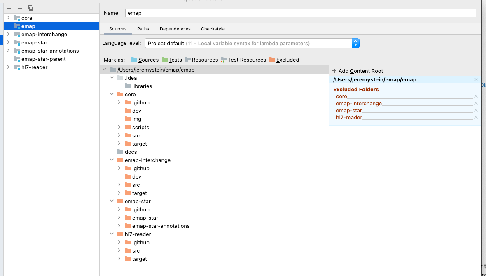

# IntelliJ project setup

For all code in monorepo + hoover.

## Local setup instructions using IntelliJ IDEA

These setup instructions are aimed at developing in [IntelliJ IDEA](https://www.jetbrains.com/idea/), but hopefully should be similar in [Eclipse](https://www.eclipse.org/downloads/).

1. <details>
    <summary>Create a parent directory</summary>

   Create a directory where all the repositories, including this one, will be cloned
   e.g.

    ```bash
    mkdir ~/projects/EMAP
    ```
</details>

2. <details>
    <summary>Clone repositories</summary>

   This repo is now a monorepo that contains the source code from several pre-existing repos (Emap-Core Emap-Interchange Inform-DB emap-hl7-processor).

    ```bash
    cd ~/projects/EMAP
    git clone https://github.com/UCLH-DHCT/emap.git
    git clone https://github.com/inform-health-informatics/hoover.git
    ```

   When `emap-setup` is updated to work with the new monorepo layout, this will also be achievable with [emap-setup](https://github.com/inform-health-informatics/emap-setup) by, once installed, running `emap setup --init`

</details>

3. <details>
    <summary>Open project in IntelliJ IDEA</summary>

   <b>File > New > New Project From existing sources</b> and select the parent directory (e.g. `~/projects/EMAP`). If prompted, choose "Create project from existing sources" and "Unmark All" if prompted to select source files for the project.
</details>

4. <details>
    <summary>Add Maven projects</summary>

   In the project pane on the top left of the IDE, switch to "Project Files" mode.

   For each of the following pom files, right-click and select <b>Add as Maven project</b>:
   - `emap/core/pom.xml`
   - `emap/emap-interchange/pom.xml`
   - `emap/emap-star/pom.xml` - NOT to be confused with `emap/emap-star/emap-star/pom.xml` (which contains the Hibernate entity definitions, but requires the annotation preprocessor)!
   - `emap/hl7-reader/pom.xml`
   - `hoover/pom.xml` (outside this repo)

   If you add one by mistake use "Unlink Maven projects" in the Maven pane, which is the opposite of "Add..."
</details>

5. <details>
    <summary>Add project root as a module</summary>
    Because the monorepo now has a root directory containing multiple module directories, the files in the root itself are not in *any* module.
    This means they won't be found by the <b>Navigate > File</b> dialogue without this step.

    Go to <b>File > Project Structure > Modules</b>. Hit the + button to add a module.

    In this example the root directory should be `~/projects/EMAP/emap`

    The aim is to make the new module look like the image below.
    Notice that every directory that is covered by another module has been excluded, otherwise it won't let you save it.
    It seems that the add module wizard is a bit broken as it won't let you Unmark All source dirs.
    You may have to add just one of them, and then delete it once created.

   

</details>

6. <details>
    <summary>Allow annotation processing</summary>

   Go to <b>File > Settings > and searching for `processor`</b>
    - Check `enable annotation preprocessing`
    - Change the production sources directory to `classes` as below

   
</details>

7. <details>
    <summary>Reload Maven projects</summary>

   In the `Maven` pane (which should now have appeared on the top right of the IDE),
   click **Reimport all maven projects** or **Reload**
</details>

8. <details>
    <summary>Add lombok and checkstyle plugins</summary>

   Go to <b>File > Settings > search for plugins</b>, search lombok and checkstyle and install them
</details>

9. <details>
    <summary>Setup checkstyle</summary>

   To allow checkstyle to be run go to <b>File > settings > search for checkstyle</b>
    - Set the version of checkstyle to the latest version
    - Click on the `+` to add a new checkstyle configuration

   

    - Make a description and select the checkstyle file `emap/emap-checker.xml`. When done, in the bottom panel of the IntelliJ select the inform rules to make the new configuration active.
      
</details>

## Running unit tests

Most repositories include unit tests in `<repo-name>/src/test/java`. 
You will probably want to set up a separate run config for each component so you can just
run the tests that are relevant.

The following modules can be set up in the same, very simple way:
- core
- hl7-reader
- emap-star

Others require some "fake" services which run in docker containers.

### Setting up modules that don't require docker containers to run

Creating a configuration as follows:
   - <b>Run > Edit Configurations</b>
   - Click on the `+` at the top left-hand side of the window
     
   - Select `Junit` from the drop down
      - Set Test kind to `All in package`
      - Set the package to `uk.ac.ucl.rits.inform.datasinks.emapstar`. Or set the module to e.g. `core` and the package to `uk.ac.ucl.rits.inform`
      - You may also want to set logging level to TRACE for our classes by defining the environmental variable:
        `LOGGING_LEVEL_UK_AC_UCL=TRACE`

You can just copy this configuration for the other modules, changing the module name each time.

### Compiling and running tests

   Go to <b>Run > Run</b>, which should create a window in the bottom pane
   

<details>
   <summary>Expand here if this gives you a compilation error</summary>

This may be fixable like so:
   - Go to the maven pane on the right-hand side and
     run the Lifecycle `clean` goal for: `Inform Annotations` and `Inform-DB`.
     Then `clean` and then `install` on `Emap Star Schema`
   - After this then select the `Reload All Maven Projects` icon at the top of the same pane as shown below

     

   - You may also need to run `Generate Sources and Update Folders For All Projects`
</details>

Tests can also be run individually by clicking the play button on a class within an IDE editor window.

### For components which require a docker container to run tests

hoover needs fake Clarity and Caboodle, and perhaps fake UDS?

See hoover repo for instructions:
https://github.com/inform-health-informatics/hoover#readme

**Still need to shuffle the docker-compose files around**

emap-in-a-box needs fakeuds, so the latter can't be deleted.
